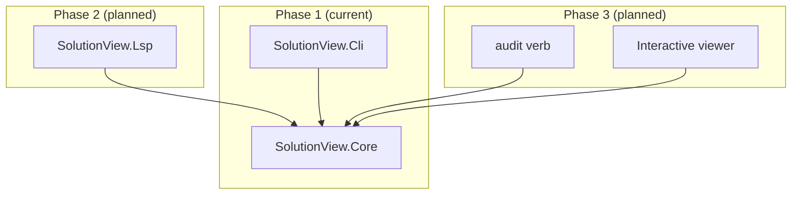

# Architecture

## Purpose

SolutionView scans a .NET solution's `.sln` and `.csproj` files and produces a dependency
graph: which projects reference which other projects, and which NuGet packages each
project references directly. The graph is emitted as JSON and rendered into human-readable
forms (Markdown, Mermaid, a terminal tree). This is the foundation for later phases:
editor integration (phase 2) and vulnerability-aware auditing (phase 3).

## Components



`SolutionView.Core` has no dependency on `SolutionView.Cli`, or on any other host — every
other component depends on it, never the reverse. See ADR-0005.

## Data flow

```
.sln / .csproj files
  -> Buildalyzer (design-time build, per ADR-0001)
    -> SolutionView.Core in-memory graph model (projects, packages, dependency edges)
      -> JSON serialization, schemaVersion-tagged (per ADR-0002) -> graph.json
        -> renderers consume graph.json independently (Markdown, Mermaid, Spectre.Console tree)
```

`graph.json` is the only thing that crosses a process boundary. Nothing downstream of
`scan` touches Buildalyzer or MSBuild directly.

## Module responsibilities

- **SolutionView.Core** — parses the `.sln`, drives Buildalyzer per project, builds the
  in-memory graph (projects, packages, dependency edges), assigns deterministic node IDs
  (ADR-0007), and serializes to / deserializes from the JSON contract defined in
  `schema/graph.v1.schema.json`. No `Console`, no CLI framework references — see ADR-0005.
- **SolutionView.Cli** — argument parsing for the `scan` / `render` / `audit` verbs, wires
  stdin/stdout/files to Core, hosts the Markdown, Mermaid, and Spectre.Console tree
  renderers.
- **SolutionView.Lsp** (phase 2, not yet built) — hosts Core behind the LSP protocol so
  editor extensions can call it via a standard LSP client; see ADR-0003.

## CLI shape

```
solutionview scan   --sln X.sln --out graph.json
solutionview render --in graph.json --format md|mermaid --out FILE
solutionview audit  --in graph.json --out graph.json      (phase 3)
```

`graph.json` is the contract between verbs (ADR-0002) — each verb only needs to read
and/or write a file matching `schema/graph.v1.schema.json`, not call into another verb's
code directly.

## Non-goals

- Not a build tool — Buildalyzer performs a design-time build (evaluation), never a full
  compile.
- Not a package manager — never modifies `.csproj` or `.sln` files.
- v1 does not track transitive package dependencies, only direct `PackageReference`s
  (ADR-0006).
- Does not build or maintain a vulnerability database — consumes an existing feed
  (ADR-0004).
